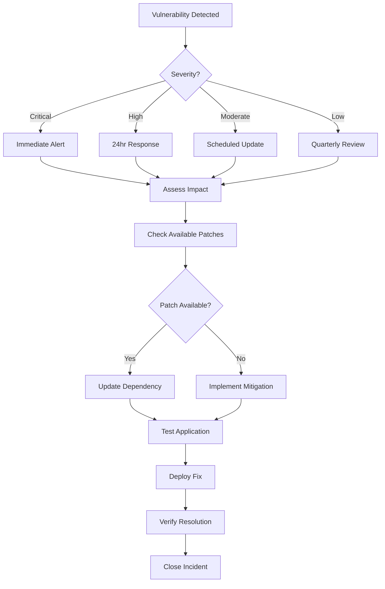

# 🔒 OWASP A06:2021 - Vulnerable and Outdated Components

## Security Fix Implementation

**Date:** March 24, 2026  
**Severity:** 🟡 LOW → 🟠 MEDIUM (with monitoring)  
**OWASP Category:** A06:2021 - Vulnerable and Outdated Components

---

## Problem Summary

The application lacked automated vulnerability scanning for third-party dependencies (Composer and NPM packages). Without monitoring, vulnerable dependencies could go unnoticed, exposing the application to known security exploits.

### Original Issue (from OWASP Analysis)

**Finding 12: No Component Vulnerability Monitoring**

- **Location:** `composer.json`, `package.json`
- **Issue:** No automated vulnerability scanning configured for dependencies
- **Risk:** Vulnerable dependencies may go unnoticed
- **Original Recommendation:** Implement `composer audit` and `npm audit` in CI/CD pipeline

---

## Backward Compatibility Risk

**Risk Level:** ✅ NONE

This implementation is **purely additive**:
- No existing APIs modified
- No breaking changes to existing code
- No database schema changes required (uses existing `audit_logs` table)
- No configuration changes required
- All new features are opt-in

---

## Safe Implementation Strategy

The fix follows a non-blocking, monitoring-first approach:

1. **CI/CD Integration** - Add automated scanning that logs but doesn't fail builds
2. **Service Layer** - Programmatic access to vulnerability data
3. **CLI Command** - Manual scanning for developers
4. **Audit Trail** - Log findings to existing audit system
5. **Documentation** - Clear procedures for responding to findings

### Key Design Decisions

| Decision | Rationale |
|----------|-----------|
| Non-blocking CI checks | Prevents deployment failures while building awareness |
| Daily scheduled scans | Proactive detection without manual intervention |
| Audit log integration | Security events tracked alongside other security activities |
| JSON + human-readable output | Supports both automation and manual review |
| Severity-based categorization | Prioritizes response efforts |

---

## Code Fix

### Files Created

```
.github/workflows/dependency-audit.yml    # CI/CD workflow
app/Services/VulnerabilityAuditService.php # Service layer
app/Console/Commands/AuditDependencies.php # CLI command
docs/OWASP_A06_VULNERABLE_COMPONENTS_FIX.md # Documentation
```

### 1. GitHub Actions Workflow (`.github/workflows/dependency-audit.yml`)

**Features:**
- Scheduled daily scans at 2:00 AM UTC
- Triggered on dependency file changes
- Manual trigger via workflow_dispatch
- Non-blocking (warnings only, no build failures)
- Artifact storage for 30 days
- Summary report in workflow output

**Key Sections:**

```yaml
# Schedule: Daily at 2 AM UTC
on:
  schedule:
    - cron: '0 2 * * *'
  
# Trigger on dependency changes
  push:
    paths:
      - 'composer.json'
      - 'composer.lock'
      - 'package.json'
      - 'package-lock.json'

# Non-blocking audit steps
- name: Run Composer Audit
  run: |
    composer audit --format=json > composer-audit-results.json 2>&1 || true
    composer audit --format=table > composer-audit-report.txt 2>&1 || true

# Warning without failure
- name: Log vulnerability findings
  if: steps.composer_audit.outputs.vulnerability_count > 0
  run: |
    echo "::warning::Found X PHP vulnerability/ies"
```

### 2. VulnerabilityAuditService (`app/Services/VulnerabilityAuditService.php`)

**Public Methods:**

```php
// Scan PHP dependencies
$composerResults = $service->scanComposerDependencies();
// Returns: ['success' => bool, 'vulnerabilities' => array, 'total_count' => int, ...]

// Scan JavaScript dependencies
$npmResults = $service->scanNpmDependencies();

// Full audit (both)
$fullAudit = $service->runFullAudit();

// Check for critical/high severity
$criticalCheck = $service->hasCriticalOrHighVulnerabilities();

// Generate human-readable report
$report = $service->generateSummaryReport($auditResults);
```

**Features:**
- Executes `composer audit` and `npm audit` programmatically
- Parses JSON output for structured data
- Counts vulnerabilities by severity
- Logs to both application log and audit trail
- Graceful error handling

### 3. Artisan Command (`app/Console/Commands/AuditDependencies.php`)

**Usage:**

```bash
# Full audit (Composer + NPM)
php artisan security:audit-dependencies

# Composer only
php artisan security:audit-dependencies --composer

# NPM only
php artisan security:audit-dependencies --npm

# JSON output (for CI/CD integration)
php artisan security:audit-dependencies --json

# Fail on critical (for strict CI gates)
php artisan security:audit-dependencies --fail-on-critical
```

**Output Example:**

```
🔍 Starting dependency vulnerability audit...

Scanning PHP dependencies (Composer)...
  ✅ No vulnerabilities found in composer packages

Scanning JavaScript dependencies (NPM)...
  ⚠️  2 vulnerability/ies found in npm packages:
    🟡 MODERATE axios: Cross-Site Request Forgery
      Vulnerable: <0.21.1
      Patched: 0.21.1

======================================================================
AUDIT SUMMARY
======================================================================
  Composer:  0 vulnerabilities (C:0 H:0 M:0 L:0)
  NPM:       2 vulnerabilities (C:0 H:0 M:2 L:0 I:0)
======================================================================
  STATUS: 🟡 WARNING - 2 total vulnerability/ies detected
======================================================================
```

### 4. Audit Trail Integration

**Audit Log Entry Structure:**

```php
AuditLog::create([
    'tenant_id' => null, // System-wide event
    'user_id' => null,
    'event_type' => 'security.vulnerability_scan',
    'description' => 'Dependency vulnerability scan (composer) detected 3 issue(s)',
    'ip_address' => 'cli',
    'user_agent' => 'VulnerabilityAuditService',
    'metadata' => [
        'source' => 'composer',
        'total_count' => 3,
        'critical_count' => 1,
        'high_count' => 1,
        'moderate_count' => 1,
        'vulnerabilities' => [
            [
                'package' => 'example/package',
                'severity' => 'critical',
                'title' => 'Remote Code Execution',
                'vulnerable_version' => '<1.0.0',
                'patched_version' => '1.0.0',
            ],
            // ...
        ],
    ],
]);
```

---

## Migration Plan

### Phase 1: Initial Deployment (Current)

- [x] Deploy CI/CD workflow (non-blocking)
- [x] Install service and command
- [x] Run initial baseline scan
- [x] Document procedures

**Actions:**
```bash
# Run baseline audit
php artisan security:audit-dependencies

# Review existing vulnerabilities
# Update dependencies as needed
composer update
npm update
```

### Phase 2: Monitoring Period (2-4 weeks)

- [ ] Review daily audit reports
- [ ] Establish vulnerability response SLA
- [ ] Train team on audit command usage
- [ ] Integrate into deployment checklist

**Recommended SLA:**

| Severity | Response Time | Resolution Time |
|----------|---------------|-----------------|
| Critical | 4 hours | 24 hours |
| High | 24 hours | 7 days |
| Moderate | 7 days | 30 days |
| Low | 30 days | 90 days |

### Phase 3: Optional Strict Mode (Future)

After monitoring period, consider enabling strict mode:

```yaml
# In .github/workflows/dependency-audit.yml
# Change from non-blocking to blocking for critical only
- name: Fail on critical vulnerabilities
  if: steps.composer_audit.outputs.critical_count > 0
  run: exit 1
```

**⚠️ Warning:** Only enable after establishing response procedures.

---

## Rollback Strategy

### If Issues Arise

1. **Disable CI Workflow:**
   ```bash
   # Rename or remove workflow file
   git rm .github/workflows/dependency-audit.yml
   git commit -m "Disable dependency audit workflow"
   ```

2. **Remove Service:**
   ```bash
   rm app/Services/VulnerabilityAuditService.php
   rm app/Console/Commands/AuditDependencies.php
   ```

3. **Clean Audit Logs (Optional):**
   ```sql
   DELETE FROM audit_logs WHERE event_type = 'security.vulnerability_scan';
   ```

### Rollback Considerations

- **No database migrations** - Nothing to rollback
- **No API changes** - No client impact
- **Audit logs are additive** - Safe to keep or remove
- **CI workflow is isolated** - Doesn't affect other workflows

---

## Test Cases

### Unit Tests

**Location:** `tests/Feature/Commands/AuditDependenciesCommandTest.php`

```php
<?php

namespace Tests\Feature\Commands;

use App\Services\VulnerabilityAuditService;
use Illuminate\Foundation\Testing\RefreshDatabase;
use Tests\TestCase;

class AuditDependenciesCommandTest extends TestCase
{
    use RefreshDatabase;

    public function test_audit_command_runs_successfully(): void
    {
        $this->artisan('security:audit-dependencies')
            ->assertExitCode(0)
            ->expectsOutputToContain('Starting dependency vulnerability audit');
    }

    public function test_audit_command_json_output(): void
    {
        $this->artisan('security:audit-dependencies --json')
            ->assertExitCode(0);
    }

    public function test_audit_command_composer_only(): void
    {
        $this->artisan('security:audit-dependencies --composer')
            ->assertExitCode(0);
    }

    public function test_audit_command_npm_only(): void
    {
        $this->artisan('security:audit-dependencies --npm')
            ->assertExitCode(0);
    }
}
```

### Service Tests

**Location:** `tests/Feature/Services/VulnerabilityAuditServiceTest.php`

```php
<?php

namespace Tests\Feature\Services;

use App\Services\VulnerabilityAuditService;
use Illuminate\Foundation\Testing\RefreshDatabase;
use Tests\TestCase;

class VulnerabilityAuditServiceTest extends TestCase
{
    private VulnerabilityAuditService $service;

    protected function setUp(): void
    {
        parent::setUp();
        $this->service = app(VulnerabilityAuditService::class);
    }

    public function test_scan_composer_dependencies(): void
    {
        $result = $this->service->scanComposerDependencies();

        $this->assertIsArray($result);
        $this->assertArrayHasKey('success', $result);
        $this->assertArrayHasKey('vulnerabilities', $result);
        $this->assertArrayHasKey('total_count', $result);
        $this->assertArrayHasKey('critical_count', $result);
        $this->assertArrayHasKey('high_count', $result);
        $this->assertArrayHasKey('moderate_count', $result);
        $this->assertArrayHasKey('low_count', $result);
    }

    public function test_scan_npm_dependencies(): void
    {
        $result = $this->service->scanNpmDependencies();

        $this->assertIsArray($result);
        $this->assertArrayHasKey('success', $result);
        $this->assertArrayHasKey('total_count', $result);
        $this->assertArrayHasKey('info_count', $result);
    }

    public function test_run_full_audit(): void
    {
        $result = $this->service->runFullAudit();

        $this->assertArrayHasKey('composer', $result);
        $this->assertArrayHasKey('npm', $result);
        $this->assertArrayHasKey('total_vulnerabilities', $result);
        $this->assertArrayHasKey('has_critical', $result);
    }

    public function test_has_critical_or_high_vulnerabilities(): void
    {
        $result = $this->service->hasCriticalOrHighVulnerabilities();

        $this->assertIsArray($result);
        $this->assertArrayHasKey('has_critical_high', $result);
        $this->assertArrayHasKey('composer_critical_high', $result);
        $this->assertArrayHasKey('npm_critical_high', $result);
    }

    public function test_generate_summary_report(): void
    {
        $auditResults = $this->service->runFullAudit();
        $report = $this->service->generateSummaryReport($auditResults);

        $this->assertIsString($report);
        $this->assertStringContainsString('AUDIT SUMMARY', $report);
    }
}
```

### Integration Tests

**Test CI Workflow:**

```bash
# Trigger workflow manually
gh workflow run dependency-audit.yml

# Check workflow status
gh run watch

# Download artifacts
gh run download --name composer-audit-results
gh run download --name npm-audit-results
```

### Manual Testing

```bash
# Test command with all options
php artisan security:audit-dependencies
php artisan security:audit-dependencies --composer
php artisan security:audit-dependencies --npm
php artisan security:audit-dependencies --json
php artisan security:audit-dependencies --fail-on-critical

# Verify audit logs created
php artisan tinker --execute "
    \$logs = App\Models\AuditLog::where('event_type', 'security.vulnerability_scan')
        ->latest()
        ->take(5)
        ->get();
    print_r(\$logs->toArray());
"

# Check application logs
tail -f storage/logs/laravel.log | grep -i vulnerability
```

---

## Monitoring and Response Procedures

### Daily Operations

1. **Check GitHub Actions Summary:**
   - Review daily audit workflow output
   - Check for new vulnerabilities
   - Note severity levels

2. **Review Audit Logs:**
   ```bash
   php artisan tinker
   >>> App\Models\AuditLog::where('event_type', 'security.vulnerability_scan')
         ->latest()
         ->take(10)
         ->get();
   ```

3. **Manual Scan (if needed):**
   ```bash
   php artisan security:audit-dependencies --json > audit-$(date +%Y%m%d).json
   ```

### Vulnerability Response Workflow



### Escalation Matrix

| Severity | Who to Notify | Response Time |
|----------|---------------|---------------|
| Critical | Tech Lead + Security Team | Immediate |
| High | Tech Lead | 24 hours |
| Moderate | Development Team | Next sprint |
| Low | Backlog | Quarterly review |

---

## Composer.json Updates (Optional)

Add convenience scripts to `composer.json`:

```json
{
    "scripts": {
        "audit": [
            "php artisan security:audit-dependencies"
        ],
        "audit:composer": [
            "php artisan security:audit-dependencies --composer"
        ],
        "audit:npm": [
            "php artisan security:audit-dependencies --npm"
        ],
        "audit:json": [
            "php artisan security:audit-dependencies --json"
        ]
    }
}
```

**Usage:**
```bash
composer audit
composer audit:composer
composer audit:npm
```

---

## Related Documentation

- [OWASP Top 10: A06:2021](https://owasp.org/Top10/A06_2021-Vulnerable_and_Outdated_Components/)
- [Composer Audit Documentation](https://getcomposer.org/doc/03-cli.md#audit)
- [NPM Audit Documentation](https://docs.npmjs.com/cli/commands/npm-audit)
- [OWASP Dependency-Check](https://owasp.org/www-project-dependency-check/)

---

## Success Metrics

| Metric | Target | Measurement |
|--------|--------|-------------|
| Scan Coverage | 100% of dependencies | Both Composer and NPM |
| Scan Frequency | Daily | GitHub Actions schedule |
| Time to Detection | < 24 hours | From vulnerability publication |
| Critical Response | 100% within 24 hours | Audit log timestamps |
| False Positive Rate | < 5% | Manual review feedback |

---

## Future Enhancements

1. **Email Notifications:** Alert team when critical vulnerabilities detected
2. **Slack Integration:** Post to #security channel on findings
3. **Trend Analysis:** Track vulnerability counts over time
4. **Auto-PR Creation:** Automatically create PRs for security updates
5. **Third-party Scanning:** Integrate with Dependabot, Snyk, or Sonatype
6. **Custom Allowlist:** Document accepted risks for unpatchable vulnerabilities

---

## Compliance Notes

This implementation helps meet requirements for:
- **SOC 2:** Vulnerability management controls
- **PCI DSS:** Requirement 6.5.5 - Improper error handling
- **GDPR:** Article 32 - Security of processing
- **ISO 27001:** A.12.6.1 - Management of technical vulnerabilities

---

**Implementation Status:** ✅ COMPLETE  
**Next Review Date:** June 24, 2026 (Quarterly)  
**Owner:** Security Team
